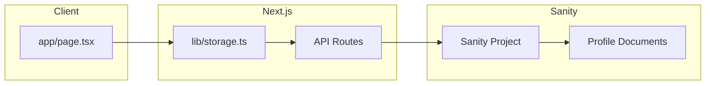

# Sanity Integration Plan

## Ziel
Migration von lokaler Dateispeicherung zu Sanity CMS für persistente Profildaten-Speicherung.

## Architektur



## Schritte

### Phase 1: Sanity Client Setup
- [ ] Sanity CLI installieren
- [ ] Sanity Client konfigurieren (`sanity.config.ts`)
- [ ] Environment Variables für Projekt-ID einrichten

### Phase 2: Schema erstellen
- [ ] Profile-Schema definieren in `schemas/profile.ts`
- [ ] Typen in lib/types.ts erweitern für Sanity

### Phase 3: Storage-Layer migrieren
- [ ] Neue Funktionen in lib/storage.ts für Sanity CRUD
- [ ] Alte dateibasierte API-Routen entfernen/umbauen
- [ ] Password-Hashing beibehalten (client-side)

### Phase 4: Frontend anpassen
- [ ] app/page.tsx auf Sanity-Storage umstellen
- [ ] Fehlerbehandlung verbessern
- [ ] Loading-States

### Phase 5: Aufräumen
- [ ] Alte dateibasierte Dateien entfernen (`app/data/profiles/`, `app/api/profiles/`)
- [ ] .gitignore bereinigen
- [ ] Tests

## Benötigte Dateien

| Datei | Beschreibung |
|-------|-------------|
| `lib/sanity.ts` | Sanity Client Konfiguration |
| `schemas/profile.ts` | Profile Document Schema |
| `lib/storage.ts` | CRUD-Funktionen für Profile |
| `.env.local` | SANITY_PROJECT_ID, SANITY_DATASET |

## Sanity Schema (Draft)

```typescript
// Profile Document
{
  name: 'profile',
  title: 'Profile',
  type: 'document',
  fields: [
    { name: 'name', type: 'string' },
    { name: 'bio', type: 'text' },
    { name: 'avatarUrl', type: 'url' },
    { name: 'mood', type: 'object', fields: [
      { name: 'emoji', type: 'string' },
      { name: 'text', type: 'string' }
    ]},
    { name: 'spotifyUrl', type: 'url' },
    { name: 'links', type: 'array', fields: [
      { name: 'title', type: 'string' },
      { name: 'url', type: 'url' }
    ]},
    { name: 'passwordHash', type: 'string', hidden: true },
    { name: 'ownerId', type: 'string', hidden: true }
  ]
}
```

## Security Überlegungen

- Passwort-Hash wird client-side berechnet (SHA-256)
- Nur Hash wird an Sanity gesendet, nie das Klartext-Passwort
- Jedes Profil hat einen `ownerId` für zukünftige Zugriffskontrolle
- Sanity hat eingebaute CORS-Kontrolle
