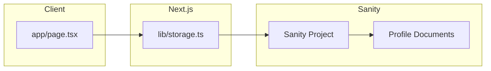

# Sanity Integration Plan

## Status: ✅ ABGESCHLOSSEN

## Architektur



## Implementierte Schritte

### Phase 1: Sanity Client Setup ✅
- [x] Sanity Client installiert (`@sanity/client`)
- [x] [`lib/sanity.ts`](lib/sanity.ts) - Client Konfiguration mit Environment Variables
- [x] [`.env.local`](.env.local) - Projekt-ID, Dataset, Token

### Phase 2: Schema erstellen ✅
- [x] [`lib/schemas/profile.ts`](lib/schemas/profile.ts) - TypeScript-Typen für Sanity Documents

### Phase 3: Storage-Layer migriert ✅
- [x] [`lib/storage.ts`](lib/storage.ts) - CRUD-Funktionen für Sanity
  - `createProfileOnServer()` - Profil erstellen
  - `saveProfileToServer()` - Profil aktualisieren
  - `loadProfileFromServer()` - Profil laden
  - `deleteProfileFromServer()` - Profil löschen
- [x] Password-Hashing (SHA-256) für Zugriffsschutz

### Phase 4: Frontend ✅
- [x] [`app/page.tsx`](app/page.tsx) - Funktioniert mit neuem Storage-Layer

### Phase 5: Aufräumen ✅
- [x] Alte dateibasierte Dateien entfernt (`app/data/`, `app/api/profiles/`)
- [x] `.gitignore` bereinigt

## Erstellte Dateien

| Datei | Beschreibung |
|-------|-------------|
| `lib/sanity.ts` | Sanity Client Konfiguration |
| `lib/schemas/profile.ts` | Sanity Document Typen |
| `lib/storage.ts` | CRUD-Funktionen (aktualisiert) |
| `.env.local` | Sanity Credentials |

## Sanity Schema

```typescript
// Profile Document Type
{
  _id: string;
  _type: "profile";
  name: string;
  bio: string;
  avatarUrl: string;
  mood: { emoji: string; text: string };
  spotifyUrl: string;
  links: Array<{ _key: string; title: string; url: string }>;
  passwordHash?: string; // SHA-256 hash
  ownerId: string;
  createdAt: string;
  updatedAt: string;
}
```

## Security

- ✅ Passwort-Hash wird client-side berechnet (SHA-256)
- ✅ Nur Hash wird an Sanity gesendet
- ✅ Jedes Profil hat `ownerId`
- ✅ Passwort-Schutz beim Laden/Aktualisieren
